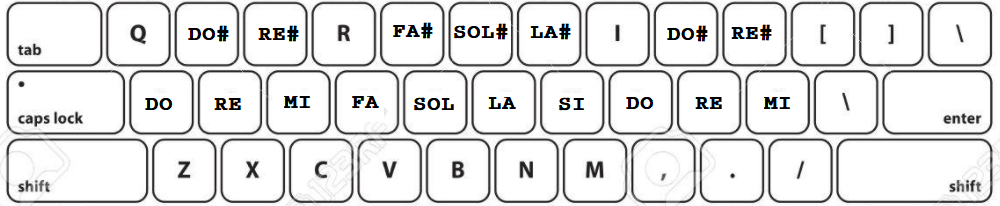

# web-audio-api-synth
Ejercicio de programación y de síntesis.
 <main>
            <h1>Sobre el Sinte y cómo usarlo</h1>
            
Esta idea de sintetizador sigue en desarollo y esta hecho con JavaScript (utilizando la 
            <a href="https://www.w3.org/TR/webaudio/" target="_blank">Web Audio API</a>), 
            html y css. Es un ejercicio de programación pero tambien uno sobre sintesis. 
            

            

                <ol>
                    <li>Para empezar a jugar, si tocas el boton "preset random", te configura los parámetros en una de cinco posibilidades que programé :)
                    </li> 
                    <li>Luego podes empezar a jugar con los parámetros desde ahí.</li> 
                    <li>La nota fundamental de cada oscilador se puede modificar de las siguientes formas:</li>
                    <ul>
                        <li>Escribiedo la frecuencia en el input "Freq" (escribiendo cualquier numero 
                            o presionado las flechas hacia arriba o abajo);</li>
                        <li>Tocando con el teclado qwerty (en notebook o desktop) 
                            
                             <strong><em>No es necesario mantener las 
                            teclas presionadas! si lo haces, se produce un descenso en volumen, no esta roto, es asi;</em></strong></li>    
                        <li>Se puede variar un poco la afinación con el input "detune", 50 cents hacia arriba o hacia abajo (50 cents = 1/4 de tono);</li>  
                        <li>Cada oscilador se puede cambiar de octava independientemente.</li>  
                    </ul>
                    <li>El sintetizador cuenta con tres osciladores que pueden prenderse o apagarse independientemente, a los cuales se les puede modificar la forma de onda (sinusoide, triangular, cuadrada
                        o diente de sierra), también el volumen, la octava y la nota.
                        Estos tres osciladores pasan por un LFO, el cual tiene parámetros de forma de onda, rate y amount y la posibilidad de modular
                        tres parametros: la frecuencia de corte del filtro, el pitch del OSC I y/o el pitch del OSC II.
                        Luego hay un filtro que puede ser LP, BP o HP, con controles de CutOff y Resonancia.
                        Finalmente un delay y luego el volumen Master. 
                    </li>      
                    <li>Si en el OSC III es tildada la casilla "free", su frecuencia no se va a modificar con el teclado 
                        junto con la de los otros dos osciladores, quedando en la ultima que fue ingresada (la cual se 
                        puede modificar a traves del input "Freq").</li>          
                    <li>La frecuencia de corte del filtro tiene 2 tipos de input: numérico y con fader, cada uno muestra 
                        su valor actual por separado. El  motivo es que tienen distinta sensibilidad, el input numerico, si  
                        se clickea sobre las flechas arriba/abajo y se mantiene presionado moviendo el mouse hacia arriba 
                        y hacia abajo, va a variar mas lentamente que el fader. </li>
                    <li>Por el cuidado de sus oidos y dispositivos, tener precaución con los volumenes, no llevar el Master al 
                        máximo, y controlar los niveles de los osciladores (gain) en función de la suma de las 
                        señales y la manipulación del filtro.</li>    
                    <li>Se recomienda comenzar probando combinar distintos tipos de onda, distintas octavas, diferenciar 
                        ligeramente la afinacion de alguno de los OSC (con detune), probar luego la respuesta de los filtros 
                        con distintas frecuencias de corte (cut) y sobre la combinacion de distintos tipos de onda. Luego introducir el LFO como factor de modulacion en el tiempo, 
                        el LFO puede modular los 3 parametros posibles simultaneamente. 
                    </li>
                    <li>
                        Se puede reducir el zoom de la ventana del navegador si es necesario para poder visualizar 
                        todos los controles. No esta pensado ni optimizado para usarse en dispositivos moviles, por el momento. 
                    </li>
                    <li>
                        Los controles se pueden manipular tambien solo con el teclado, usando la tecla TAB 
                        para desplazarse, las flechas del teclado para incrementar/disminuir, y el enter 
                        para ingresar en los selectores de onda por ejemplo.
                    </li>  
                </ol>
            
        
        

            Data útil: 
            <a href="http://www.michaelnorris.info/theory/harmonicseriescalculator" target="_blank">harmonic series calculator</a>    
            <a href="https://pages.mtu.edu/~suits/notefreqs.html" target="_blank">Frequencies for equal-tempered scale, A4 = 440 Hz</a>  
            <b>Proximas mejoras podrian ser la incorporacion de MIDI y manipulacion de la envolvente :3</b>
            Podes jugar con el sinte <a href="https://jusrecondo.github.io/waa-synth/" target="_blank">ver Acá</a>
        

    </main>